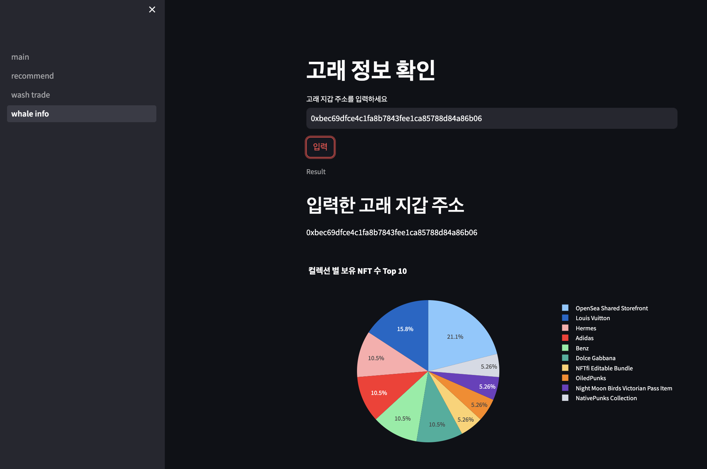
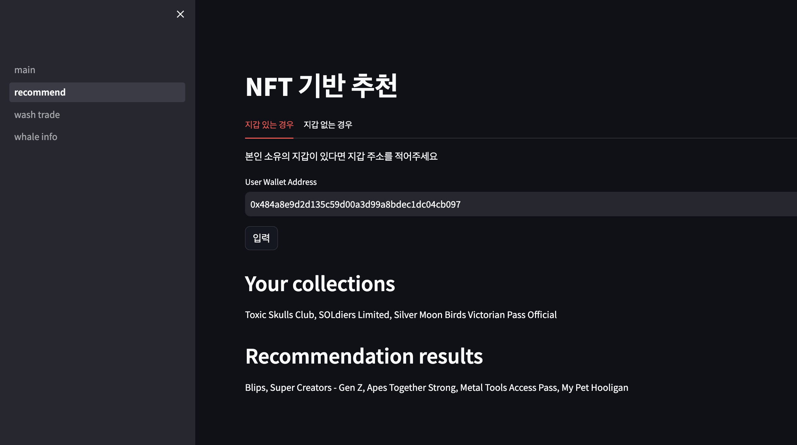
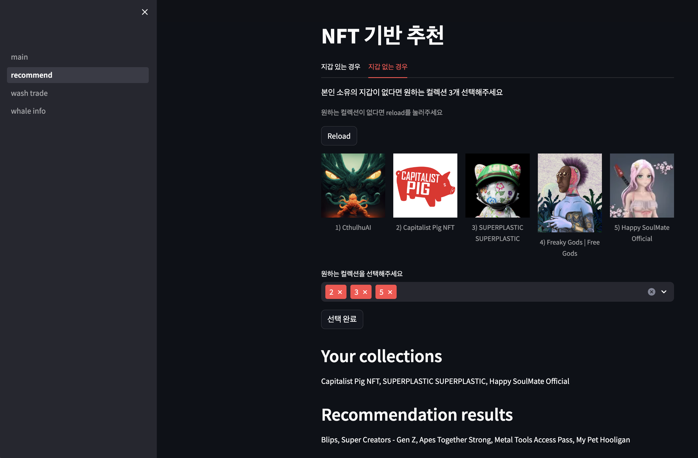
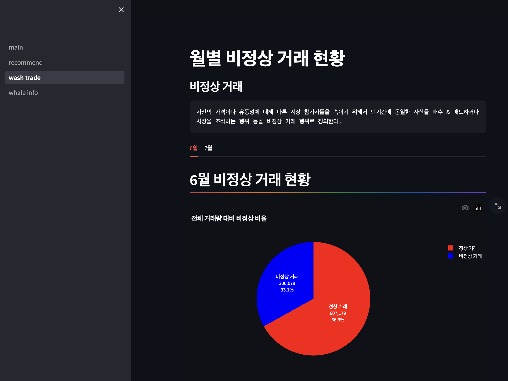
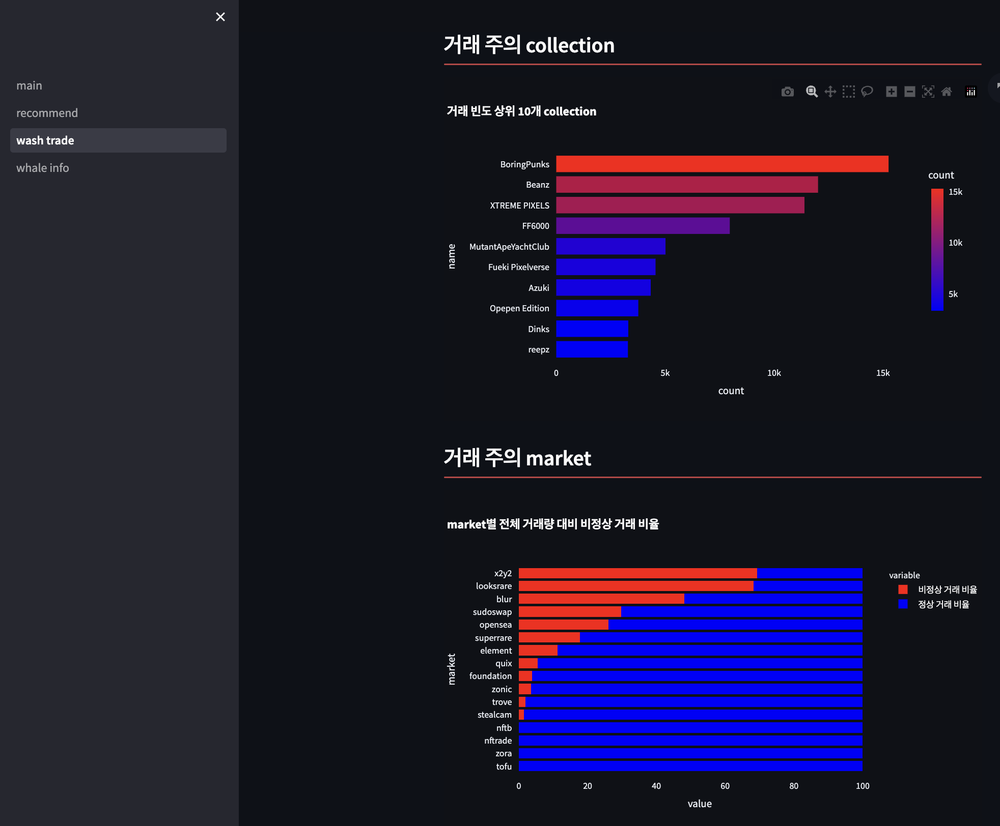

# 고래 데이터 기반 NFT 추천시스템 웹페이지
## Intro
Streamlit을 통해 NFT 추천 시스템을 이용하고 wash trade 관련 통계를 볼 수 있는 웹페이지를 구현합니다.

### main 페이지


### 고래 정보 확인 페이지


### 추천시스템 페이지
* 지갑이 있는 경우

* 지갑이 없는 경우


### wash trade 통계 페이지
* 월별 wash trade 비율


* 월별 거래주의 collection과 market



## Requirements
```
pip install -r requirements.txt
```


## Streamlit 실행
```
# run 다음에 메인 페이지의 파일명 입력
streamlit run main.py
```